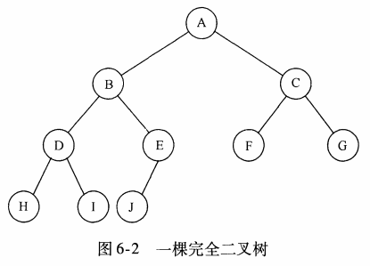
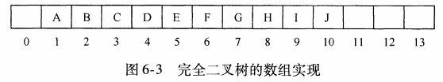
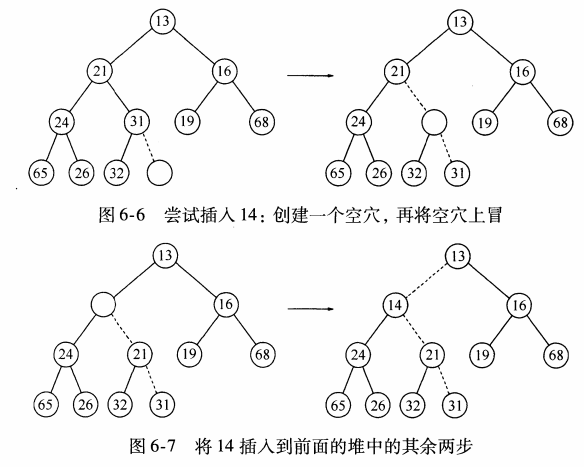

# Heap(Priority queue)

## Model

insert 相当于enqueue

deleteMin 相当于 dequeue


## 简单实现

简单链表：insert采用头插 O(1),deleteMin采用遍历 O(N)

始终让链表保持排序状态：insert O(N)，deleteMin O(1)

二叉查找树:

## 二叉堆




### 结构性质

堆是完全二叉树(树被完全填满，有可能的例外是在底层)

用数组来表示完全二叉树



不难得出，对于数组中任意位置i上的元素，其左儿子在位置2i上，右儿子在2i+1上，父亲在i/2上。

因此，一个堆结构可用一个数组和一个代表当前堆大小的整数组成。

### 堆序性质

小在上，大在下

### 基本堆操作

#### insert

采用上滤法(percolate up)实现插入



在下一个可用位置创建空穴，若x可直接插入，则插入完成，否则将空穴父节点移入空穴，递归地进行该操作，直到X可以插入。


```java
 public void insert(AnyType x){
        //enlarge
        if(currentSize == array.length-1){
            enlargeArray(array.length*2+1);
        }
        
        int hole = ++currentSize;
        //0位置的妙用
        for (array[0] = x;x.compareTo(array[hole/2])<0;hole/=2){
            array[hole] = array[hole/2];
        }
        array[hole] = x;
    }
```

* 0位置的妙用：
  * 如果使用交换来完成，一次交换需要3条赋值语句，因此采用这里的方法减少赋值次数。
  * 如果要插入的元素是新的最小值，它将一直被推向顶端，这时候hole将是1，可以用显示的测试将循环跳出，但将被插入项的引用放到位置0更佳
  
#### deleteMin
采用下滤法进行删除
当删除最小元时，在该处建立空穴，如果堆中最后一个元素X能直接移动到空穴，则操作完成，若不能，则将空穴孩子中最小的一个儿子向上移，直至X可以移入空穴

```java
public AnyType deleteMin() throws Exception {
        if(isEmpty()) throw new Exception();
        
        AnyType minItem = findMin();
        
        array[1] = array[currentSize--];
        
        percolateDown(1);
        
        return minItem;
    }
```


```java
private void percolateDown(int hole){
        int child;
        AnyType tmp = array[hole];
        for (;hole*2<=currentSize;hole=child){
            child = hole*2;
            if(child!=currentSize&&array[child+1].compareTo(array[child])<0){
                child++;
            }
            if(array[child].compareTo(tmp)<0)
                array[hole] = array[child];
            else break;
        }
        array[hole] = tmp;
    }
```

### 其他操作


